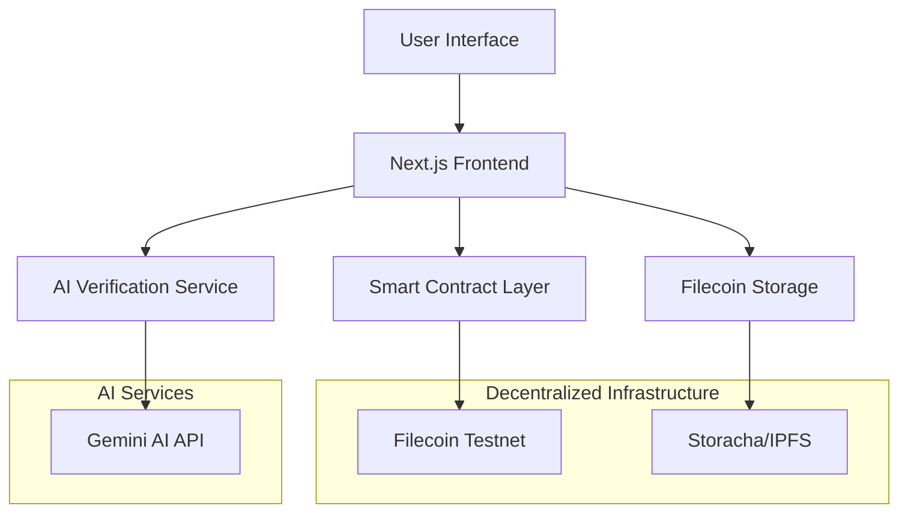

# Dallnk - Decentralized Data Bounty Platform

**A decentralized data sharing and verification platform built on Filecoin with AI-powered validation**

[](https://nextjs.org/)
[](https://filecoin.io/)
[](https://ai.google.dev/)
[](https://www.typescriptlang.org/)

## 🌟 Overview

Dallnk is a revolutionary decentralized platform that connects data requesters with data providers through a transparent bounty system. Built on the Filecoin network for decentralized storage and powered by advanced AI agents for automated verification, Dallnk ensures data integrity, accessibility, and fair compensation.

### 🎯 Key Features

- **🗄️ Decentralized Storage**: Built on Filecoin's robust infrastructure using Storacha/IPFS
- **🤖 AI-Powered Verification**: Automated data validation using Gemini 2.0 Flash
- **💰 Smart Contract Bounties**: Transparent, automated payment system
- **🔐 Secure Transactions**: Blockchain-based trust and transparency
- **📊 Real-time Tracking**: Monitor bounty status and submissions in real-time
- **🎨 Modern UI**: Responsive design with smooth animations

## 📋 Table of Contents

- [Architecture](#-architecture)
- [Filecoin Integration](#-filecoin-integration)
- [AI Agent System](#-ai-agent-system)
- [Smart Contract Layer](#-smart-contract-layer)
- [Getting Started](#-getting-started)
- [API Documentation](#-api-documentation)
- [Usage Guide](#-usage-guide)
- [Deployment](#-deployment)
- [Contributing](#-contributing)

## 🏗️ Architecture



### Core Components

1. **Frontend Layer**: Next.js 15.5.4 with TypeScript and TailwindCSS
2. **Blockchain Layer**: Filecoin testnet smart contracts
3. **Storage Layer**: Storacha (evolved from Web3.Storage) with IPFS
4. **AI Layer**: Google Gemini 2.0 Flash for data verification
5. **Authentication**: MetaMask wallet integration

## 📁 Filecoin Integration

### Decentralized Storage Architecture

Dallnk leverages Filecoin's decentralized storage network to ensure data permanence, accessibility, and censorship resistance.

#### Storage Flow

```typescript
// Storage Implementation (app/utils/web3storage.ts)
interface StorageResult {
  success: boolean;
  cid?: string;
  error?: string;
}

// Upload to Filecoin via Storacha
export const uploadToFilecoin = async (
  file: File,
  email: string
): Promise<StorageResult> => {
  // Creates IPFS CID and stores on Filecoin network
  // Returns permanent content identifier
};
```

### Key Storage Features

#### 1. **IPFS Content Addressing**

```typescript
// Each file gets a unique Content Identifier (CID)
const cid = "bafybeigdyrzt5sfp7udm7hu76uh7y26nf3efuylqabf3oclgtqy55fbzdi";
const ipfsUrl = `https://w3s.link/ipfs/${cid}`;
```

#### 2. **Decentralized Retrieval**

```typescript
// Files accessible from any IPFS gateway
const gateways = [
  "https://w3s.link/ipfs/",
  "https://ipfs.io/ipfs/",
  "https://gateway.pinata.cloud/ipfs/",
];
```

#### 3. **Storage Verification**

- **Cryptographic Proof**: Each file upload generates a unique hash
- **Immutability**: Content cannot be altered without changing the CID
- **Redundancy**: Files replicated across multiple Filecoin storage providers

### Storage Benefits

| Traditional Storage     | Filecoin Storage     |
| ----------------------- | -------------------- |
| Centralized servers     | Distributed network  |
| Single point of failure | Redundant storage    |
| Vendor lock-in          | Interoperable        |
| Censorship risk         | Censorship resistant |
| Limited lifecycle       | Permanent storage    |

## 🤖 AI Agent System

### Intelligent Data Verification

Dallnk employs advanced AI agents powered by Google's Gemini 2.0 Flash model to automatically verify data submissions against bounty requirements.

#### AI Verification Pipeline

```typescript
// AI Verification Flow (app/api/verify/route.ts)
interface VerificationRequest {
  cid: string; // IPFS content identifier
  requirements: string; // Bounty requirements
  fileType: string; // MIME type
  fileSize: number; // File size in bytes
}

interface VerificationResult {
  isValid: boolean; // Verification outcome
  confidence: number; // AI confidence score (0-1)
  reasoning: string; // Detailed explanation
  issues?: string[]; // Identified concerns
}
```

### AI Analysis Criteria

#### 1. **Format Compatibility**

```typescript
// AI evaluates file format against requirements
const formatAnalysis = {
  expectedTypes: ["CSV", "JSON", "PDF"],
  actualType: "text/csv",
  compatibility: true,
  score: 0.95,
};
```

#### 2. **Content Relevance**

```typescript
// Semantic analysis of data relevance
const contentAnalysis = {
  requirements: "Financial quarterly data",
  dataDescription: "Q3 2024 revenue reports",
  relevanceScore: 0.87,
  keywordMatch: true,
};
```

#### 3. **Quality Assessment**

```typescript
// Data quality indicators
const qualityMetrics = {
  fileSize: "appropriate", // Size vs content type
  structure: "well-formatted", // Data organization
  completeness: "comprehensive", // Information coverage
  reliability: 0.91, // Overall quality score
};
```

### AI Security Features

#### Server-Side Processing

```typescript
// Secure API endpoint (app/api/verify/route.ts)
export async function POST(request: NextRequest) {
  // API key secured server-side
  const genAI = new GoogleGenerativeAI(process.env.GEMINI_API_KEY);

  // Comprehensive prompt engineering
  const prompt = `
    Analyze this data submission for a bounty request:
    - IPFS CID: ${cid}
    - Requirements: ${requirements}
    - File Type: ${fileType}
    - File Size: ${fileSize} bytes
    
    Provide structured verification with confidence scoring.
  `;
}
```

#### Fallback Mechanisms

```typescript
// Graceful degradation when AI unavailable
const fallbackVerification = {
  basicFormatCheck: true,
  sizeValidation: true,
  defaultApproval: false, // Conservative approach
  humanReviewRequired: true,
};
```

### AI Verification Advantages

- **Automated Processing**: Instant verification without human intervention
- **Consistent Standards**: Uniform evaluation criteria across all submissions
- **Scalability**: Handle thousands of submissions simultaneously
- **Cost Efficiency**: Reduce manual review overhead
- **24/7 Availability**: Continuous operation without downtime

## 💼 Smart Contract Layer

### Bounty Management System

Smart contracts handle all bounty lifecycle management on the Filecoin testnet.

#### Contract Architecture

```solidity
// Core data structure
struct DataRequest {
    uint256 id;
    string description;
    string requirements;
    uint256 bounty;
    address requester;
    address assignedMiner;
    string ipfsHash;
    bool isVerified;
    bool isPaid;
    uint256 timestamp;
}
```

#### Key Functions

```typescript
// Bounty creation
announceDataRequest(description: string, requirements: string)

// Data submission
submitDataForRequest(requestId: uint256, ipfsHash: string)

// Verification (by bounty creator)
verifySubmittedData(requestId: uint256, isValid: bool)

// Payment release
confirmAndPay(requestId: uint256)
```

## 🚀 Getting Started

### Prerequisites

- Node.js 18+
- MetaMask wallet
- Filecoin testnet tokens (tFIL)

### Installation

1. **Clone the repository**

```bash
git clone https://github.com/cridiv/Dallnk.git
cd Dallnk/dallnk-frontend
```

2. **Install dependencies**

```bash
npm install
```

3. **Environment setup**

```bash
# Create .env.local file
GEMINI_API_KEY=your_gemini_api_key
NEXT_PUBLIC_STORACHA_EMAIL=your_email@example.com
```

4. **Run development server**

```bash
npm run dev
```

5. **Access the application**

```
http://localhost:3000
```

### Network Configuration

Configure MetaMask for Filecoin testnet:

```json
{
  "chainId": "0x4CB2F",
  "chainName": "Filecoin Testnet",
  "rpcUrls": ["https://api.calibration.node.glif.io/rpc/v1"],
  "nativeCurrency": {
    "name": "testnet filecoin",
    "symbol": "tFIL",
    "decimals": 18
  },
  "blockExplorerUrls": ["https://calibration.filscan.io/"]
}
```

## 📖 API Documentation

### Bounty Management APIs

#### Create Bounty

```typescript
POST /api/bounty/create
{
  "description": "Financial quarterly data needed",
  "requirements": "CSV format with revenue data",
  "bounty": "10" // tFIL amount
}
```

#### AI Verification

```typescript
POST /api/verify
{
  "cid": "bafybeigdyrzt5sfp7udm7hu76uh7y26nf3efuylqabf3oclgtqy55fbzdi",
  "requirements": "Detailed requirements string",
  "fileType": "text/csv",
  "fileSize": 1024000
}

Response:
{
  "isValid": true,
  "confidence": 0.87,
  "reasoning": "File format and content align with requirements",
  "issues": []
}
```

### Storage APIs

#### File Upload

```typescript
// Upload to Filecoin via Storacha
const result = await uploadToFilecoin(file, email);
// Returns: { success: true, cid: "bafybeig..." }
```

#### File Download

```typescript
// Download from IPFS
const url = `https://w3s.link/ipfs/${cid}`;
await downloadFromIPFS(cid, filename);
```

## 📚 Usage Guide

### For Data Requesters

1. **Connect Wallet**: Link your MetaMask wallet
2. **Create Bounty**: Define requirements and set reward amount
3. **Review Submissions**: Use AI-powered verification
4. **Release Payment**: Approve and pay for accepted data

### For Data Providers

1. **Browse Bounties**: Explore available data requests
2. **Upload Data**: Submit files to Filecoin storage
3. **Await Verification**: AI agent validates your submission
4. **Receive Payment**: Get compensated for approved data

### Workflow Example

```typescript
// 1. Data Requester creates bounty
const bounty = await createBounty({
  description: "E-commerce transaction data",
  requirements: "JSON format, 2023 data, minimum 10k records",
  amount: ethers.parseEther("25"), // 25 tFIL
});

// 2. Data Provider submits data
const submission = await submitData({
  bountyId: bounty.id,
  file: transactionData,
  description: "Q1-Q4 2023 e-commerce transactions",
});

// 3. AI verification runs automatically
const verification = await verifyWithAI({
  cid: submission.cid,
  requirements: bounty.requirements,
});

// 4. Bounty creator reviews and approves
if (verification.isValid && verification.confidence > 0.8) {
  await acceptSubmission(bounty.id);
  await releasePayment(bounty.id);
}
```

## 🌐 Deployment

### Vercel Deployment (Recommended)

1. **Connect repository** to Vercel
2. **Set environment variables**:
   ```
   GEMINI_API_KEY=your_key_here
   NEXT_PUBLIC_STORACHA_EMAIL=your_email
   ```
3. **Deploy**: Automatic deployment on git push

### Build Configuration

```json
// package.json
{
  "scripts": {
    "build": "next build",
    "start": "next start"
  }
}
```

### Production Considerations

- **API Rate Limits**: Implement rate limiting for AI verification
- **Storage Quotas**: Monitor Storacha usage limits
- **Gas Optimization**: Optimize smart contract interactions
- **Error Handling**: Comprehensive error tracking and recovery

## 🔧 Configuration

### TailwindCSS Setup

```javascript
// tailwind.config.js
module.exports = {
  content: ["./app/**/*.{js,ts,jsx,tsx,mdx}"],
  theme: {
    extend: {
      colors: {
        "filecoin-blue": "#0090ff",
        "ai-purple": "#7c3aed",
      },
    },
  },
};
```

### Next.js Configuration

```javascript
// next.config.js
/** @type {import('next').NextConfig} */
const nextConfig = {
  experimental: {
    serverActions: true,
  },
  images: {
    domains: ["w3s.link", "ipfs.io"],
  },
};
```

## 🛡️ Security

### Data Protection

- **End-to-End Encryption**: Files encrypted before upload
- **Access Control**: Smart contract-based permissions
- **Immutable Records**: Blockchain transaction history

### AI Security

- **Server-Side Processing**: API keys never exposed to client
- **Input Validation**: Comprehensive request sanitization
- **Rate Limiting**: Prevent API abuse

### Smart Contract Security

- **Audit Ready**: Clean, documented contract code
- **Access Controls**: Role-based permission system
- **Reentrancy Protection**: Secure payment mechanisms

## 🤝 Contributing

We welcome contributions! Please see our [Contributing Guide](CONTRIBUTING.md) for details.

### Development Workflow

1. Fork the repository
2. Create feature branch (`git checkout -b feature/amazing-feature`)
3. Commit changes (`git commit -m 'Add amazing feature'`)
4. Push to branch (`git push origin feature/amazing-feature`)
5. Open Pull Request

### Code Standards

- **TypeScript**: Strict type checking enabled
- **ESLint**: Consistent code formatting
- **Testing**: Comprehensive test coverage
- **Documentation**: Clear code comments

## 📄 License

This project is licensed under the MIT License - see the [LICENSE](LICENSE) file for details.

## 🙏 Acknowledgments

- **Filecoin Foundation**: For decentralized storage infrastructure
- **Google AI**: For Gemini API access
- **Next.js Team**: For the excellent React framework
- **Storacha**: For seamless IPFS integration

## 👨‍💻 Authors

Aderemi Ademola – (X: @crid_iv)
Olaniyi Ezekiel – (X: @)
Peters Joshua – (X: @joshpet77)

---

## **Built with ❤️ by the Dallnk team**

_Empowering decentralized data sharing through AI and blockchain technology_
