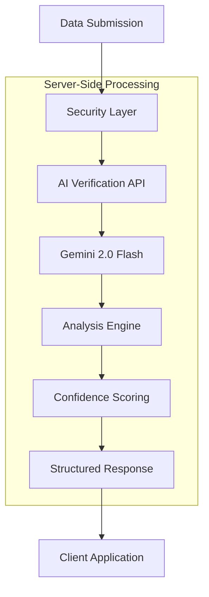

# AI Agent Documentation

## Overview

Dallnk's AI Agent system provides intelligent, automated verification of data submissions using Google's Gemini 2.0 Flash model. This system ensures data quality, relevance, and compliance with bounty requirements while maintaining security and scalability.

## AI Architecture



## Core Components

### 1. Secure API Endpoint

The AI verification runs entirely server-side to protect API keys and ensure consistent processing:

```typescript
// app/api/verify/route.ts
export async function POST(request: NextRequest) {
  // Secure API key handling
  if (!process.env.GEMINI_API_KEY) {
    return NextResponse.json(
      { error: "AI service unavailable" },
      { status: 500 }
    );
  }

  // Request validation
  const { cid, requirements, fileType, fileSize } = await request.json();

  // Initialize Gemini AI
  const genAI = new GoogleGenerativeAI(process.env.GEMINI_API_KEY);
  const model = genAI.getGenerativeModel({
    model: "gemini-2.0-flash-exp",
  });
}
```

### 2. Intelligent Prompt Engineering

The AI agent uses carefully crafted prompts to ensure accurate and consistent analysis:

```typescript
const analysisPrompt = `
You are an AI data verification specialist. Analyze this data submission for a bounty request.

SUBMISSION DETAILS:
- IPFS CID: ${cid}
- File Type: ${fileType}
- File Size: ${fileSize} bytes

REQUIREMENTS TO VERIFY:
${requirements}

VERIFICATION CRITERIA:
1. Does the file type match what would be expected for the requirements?
2. Is the file size reasonable for the type of data requested?
3. Does the IPFS CID format appear valid?
4. Are there any obvious red flags or concerns?

Please provide a JSON response with:
{
  "isValid": boolean,
  "confidence": number (0-1),
  "reasoning": "detailed explanation",
  "issues": ["array of any concerns or issues found"]
}

Be thorough but fair in your assessment. Minor issues shouldn't automatically invalidate good submissions.
`;
```

### 3. Response Processing

The AI agent processes Gemini responses with fallback handling:

```typescript
// Parse and validate AI response
let verificationResult: VerificationResult;
try {
  // Extract JSON from response
  const jsonMatch = text.match(/\{[\s\S]*\}/);
  const jsonStr = jsonMatch ? jsonMatch[0] : text;
  verificationResult = JSON.parse(jsonStr);
} catch (parseError) {
  // Graceful fallback
  verificationResult = {
    isValid: true,
    confidence: 0.5,
    reasoning: `AI verification completed but response format was unexpected. Original response: ${text}`,
    issues: ["Response parsing issue"],
  };
}
```

## Verification Process

### Step 1: Submission Analysis

```typescript
interface VerificationRequest {
  cid: string; // IPFS Content Identifier
  requirements: string; // Bounty requirements text
  fileType: string; // MIME type (e.g., "text/csv")
  fileSize: number; // Size in bytes
}
```

The AI analyzes multiple aspects:

- **Format Compatibility**: Does file type match requirements?
- **Size Appropriateness**: Is file size reasonable for content?
- **CID Validity**: Is the IPFS hash properly formatted?
- **Content Relevance**: Does submission appear relevant?

### Step 2: Confidence Scoring

```typescript
interface VerificationResult {
  isValid: boolean; // Overall approval/rejection
  confidence: number; // Confidence score (0.0 - 1.0)
  reasoning: string; // Human-readable explanation
  issues?: string[]; // Array of identified concerns
}
```

**Confidence Levels:**

- `0.9 - 1.0`: High confidence, clear match
- `0.7 - 0.89`: Good confidence, minor concerns
- `0.5 - 0.69`: Medium confidence, notable issues
- `0.3 - 0.49`: Low confidence, significant problems
- `0.0 - 0.29`: Very low confidence, likely invalid

### Step 3: Decision Making

```typescript
// Client-side integration (app/utils/aiVerification.ts)
export const verifyDataWithAI = async (
  cid: string,
  description: string,
  requirements: string,
  fileType: string,
  fileSize: number
): Promise<VerificationResult> => {
  // Call secure API endpoint
  const response = await fetch("/api/verify", {
    method: "POST",
    headers: { "Content-Type": "application/json" },
    body: JSON.stringify({
      cid,
      requirements: `${description} - ${requirements}`,
      fileType,
      fileSize,
    }),
  });

  const apiResult = await response.json();

  // Convert to internal format
  return {
    isApproved: apiResult.isValid,
    confidence: Math.max(0, Math.min(100, apiResult.confidence * 100 || 50)),
    reason: apiResult.reasoning || "No reason provided",
    analysis: {
      formatMatch: !apiResult.issues?.includes("Wrong format"),
      contentRelevance: apiResult.confidence * 100 || 50,
      qualityScore: apiResult.isValid ? 70 : 30,
    },
  };
};
```

## AI Analysis Examples

### Example 1: CSV Data Request

**Request:**

```json
{
  "requirements": "Financial quarterly data in CSV format",
  "fileType": "text/csv",
  "fileSize": 2048000,
  "cid": "bafybeigdyrzt5sfp7udm7hu76uh7y26nf3efuylqabf3oclgtqy55fbzdi"
}
```

**AI Response:**

```json
{
  "isValid": true,
  "confidence": 0.92,
  "reasoning": "File type (CSV) perfectly matches requirements for financial data. File size (2MB) is appropriate for quarterly financial data. IPFS CID format is valid. No red flags identified.",
  "issues": []
}
```

### Example 2: Format Mismatch

**Request:**

```json
{
  "requirements": "Image dataset for machine learning training",
  "fileType": "text/plain",
  "fileSize": 1024,
  "cid": "bafybeiabc123..."
}
```

**AI Response:**

```json
{
  "isValid": false,
  "confidence": 0.15,
  "reasoning": "Significant format mismatch: requirements specify image dataset but submitted file is plain text. File size (1KB) is too small for meaningful image dataset. This appears to be a wrong submission.",
  "issues": [
    "Wrong format - text file instead of images",
    "File too small for image dataset",
    "Content type mismatch"
  ]
}
```

## Security Features

### API Key Protection

```typescript
// Server-side environment variable
const apiKey = process.env.GEMINI_API_KEY; // Never exposed to client

// Client cannot access API key
// All AI calls routed through secure endpoint
```

### Input Validation

```typescript
// Comprehensive request validation
if (!cid || !requirements || !fileType || !fileSize) {
  return NextResponse.json(
    { error: "Missing required fields" },
    { status: 400 }
  );
}

// CID format validation
const cidPattern = /^bafy[a-z0-9]{50,}$/;
if (!cidPattern.test(cid)) {
  return { error: "Invalid IPFS CID format" };
}
```

### Rate Limiting (Future Enhancement)

```typescript
// Planned rate limiting implementation
const rateLimitConfig = {
  windowMs: 15 * 60 * 1000, // 15 minutes
  max: 100, // Limit each IP to 100 requests per windowMs
  message: "Too many verification requests, please try again later",
};
```

## Fallback Mechanisms

### Basic Rule-Based Validation

When AI is unavailable, the system falls back to rule-based validation:

```typescript
const checkBasicFormat = (
  fileType: string,
  description: string,
  requirements: string
): boolean => {
  const desc = (description + " " + requirements).toLowerCase();

  // Format matching rules
  if (fileType.includes("csv") && desc.includes("csv")) return true;
  if (fileType.includes("json") && desc.includes("json")) return true;
  if (
    fileType.includes("image") &&
    (desc.includes("image") || desc.includes("photo"))
  )
    return true;

  // General data files
  if (fileType.includes("csv") || fileType.includes("json")) {
    return desc.includes("data") || desc.includes("dataset");
  }

  return true; // Default to true for unknown combinations
};

const checkFileSize = (size: number, requirements: string): boolean => {
  const req = requirements.toLowerCase();
  const sizeMB = size / (1024 * 1024);

  // Size validation rules
  if (sizeMB < 0.001) return false; // Too small (< 1KB)
  if (sizeMB > 500) return false; // Too large (> 500MB)

  // Contextual size checks
  if (req.includes("large") && sizeMB < 1) return false;
  if (req.includes("small") && sizeMB > 10) return false;

  return true;
};
```

### Graceful Degradation

```typescript
try {
  // Attempt AI verification
  return await aiVerification(request);
} catch (error) {
  console.error("AI verification failed:", error);

  // Fall back to basic validation
  const basicChecks = performBasicValidation(request);

  return {
    isValid: basicChecks.passed,
    confidence: 0.3, // Low confidence for fallback
    reasoning: `AI unavailable. Basic validation: ${basicChecks.summary}`,
    issues: basicChecks.issues,
  };
}
```

## Performance Optimization

### Caching Strategy

```typescript
// Response caching for identical requests
const verificationCache = new Map<string, VerificationResult>();

const getCacheKey = (request: VerificationRequest): string => {
  return `${request.cid}-${request.fileType}-${request.fileSize}`;
};

// Check cache before AI call
const cacheKey = getCacheKey(request);
const cached = verificationCache.get(cacheKey);
if (cached) {
  return cached;
}
```

### Batch Processing

```typescript
// Future enhancement: batch multiple verifications
const batchVerify = async (requests: VerificationRequest[]) => {
  const batchPrompt = requests
    .map((req, index) => `Submission ${index + 1}: ${JSON.stringify(req)}`)
    .join("\n");

  // Single AI call for multiple verifications
  const response = await model.generateContent(batchPrompt);
  return parseMultipleResponses(response.text());
};
```

## Quality Assurance

### Prompt Testing

```typescript
// Test prompts with known data
const testCases = [
  {
    name: "Valid CSV submission",
    input: { /* test data */ },
    expected: { isValid: true, confidence: > 0.8 }
  },
  {
    name: "Invalid format",
    input: { /* test data */ },
    expected: { isValid: false, confidence: < 0.3 }
  }
];
```

### Monitoring & Analytics

```typescript
// Track AI performance metrics
interface AIMetrics {
  totalRequests: number;
  averageConfidence: number;
  accuracyRate: number;
  responseTime: number;
  errorRate: number;
}
```

## Future Enhancements

### Advanced Analysis

- **Content Preview**: Analyze file contents when possible
- **Semantic Matching**: Deep understanding of data relationships
- **Quality Scoring**: More sophisticated quality metrics

### Multi-Model Support

```typescript
// Support for multiple AI models
const models = {
  gemini: new GoogleGenerativeAI(process.env.GEMINI_API_KEY),
  claude: new AnthropicAI(process.env.CLAUDE_API_KEY),
  gpt: new OpenAI(process.env.OPENAI_API_KEY),
};

const getVerification = async (request, preferredModel = "gemini") => {
  try {
    return await models[preferredModel].verify(request);
  } catch (error) {
    // Fallback to other models
    return await fallbackVerification(request);
  }
};
```

### Learning & Adaptation

- **Feedback Integration**: Learn from human reviewer corrections
- **Custom Models**: Train domain-specific verification models
- **Confidence Calibration**: Improve confidence scoring accuracy

---

The AI Agent system in Dallnk represents a sophisticated approach to automated data verification, combining cutting-edge AI technology with robust security and fallback mechanisms to ensure reliable, scalable bounty verification.
