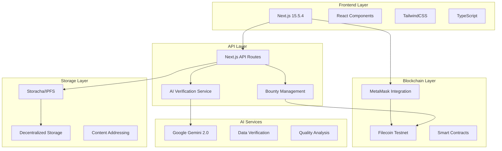
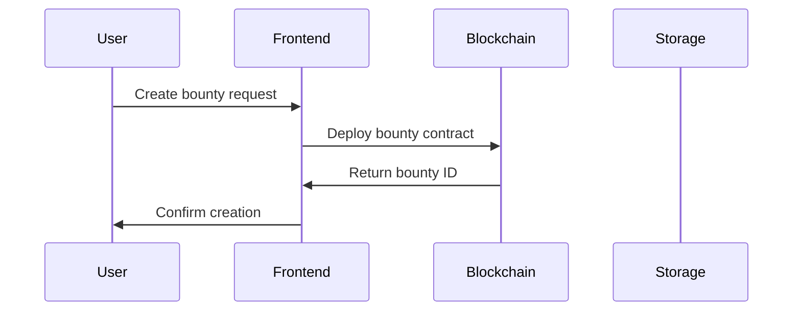
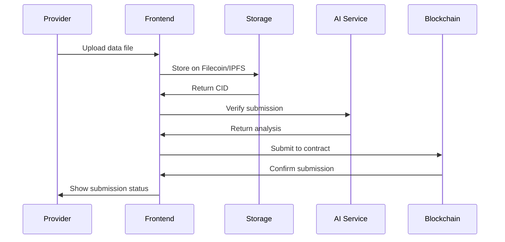
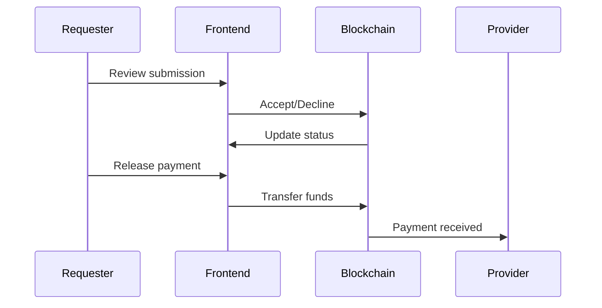

# Technical Architecture

## System Overview

Dallnk is built as a modern, decentralized application combining blockchain technology, AI services, and distributed storage to create a trustless data bounty platform.



## Technology Stack

### Frontend Technologies

#### Next.js 15.5.4

- **App Router**: Modern routing with server components
- **Server Actions**: Direct server-side function calls
- **Image Optimization**: Automatic image optimization
- **Bundle Optimization**: Automatic code splitting

```typescript
// next.config.js
/** @type {import('next').NextConfig} */
const nextConfig = {
  experimental: {
    serverActions: true,
  },
  images: {
    domains: ["w3s.link", "ipfs.io"],
  },
};
```

#### React 19

- **Concurrent Features**: Improved performance
- **Server Components**: Reduced client-side JavaScript
- **Hooks**: Modern state management

#### TailwindCSS 3.4

- **Utility-First**: Rapid UI development
- **Responsive Design**: Mobile-first approach
- **Custom Animations**: Smooth user interactions

```css
/* globals.css */
@tailwind base;
@tailwind components;
@tailwind utilities;

.grid-background {
  background-image: url("data:image/svg+xml,%3Csvg width='20' height='20' viewBox='0 0 20 20' xmlns='http://www.w3.org/2000/svg'%3E%3Ccircle cx='10' cy='10' r='1' fill='oklch(62.078% 0.20567 259.002 / 2)'/%3E%3C/svg%3E");
  background-size: 20px 20px;
}
```

### Backend Architecture

#### API Routes Structure

```
app/api/
├── verify/
│   └── route.ts           # AI verification endpoint
└── bounty/
    ├── create/
    │   └── route.ts       # Bounty creation
    ├── submit/
    │   └── route.ts       # Data submission
    └── manage/
        └── route.ts       # Bounty management
```

#### Utility Services

```
app/utils/
├── aiVerification.ts      # AI service integration
├── bountyManagement.ts    # Smart contract interactions
├── web3storage.ts         # Filecoin storage
├── contract.ts            # Blockchain utilities
└── rateLimiting.ts        # API protection
```

### Blockchain Integration

#### Smart Contract Architecture

```solidity
contract DataBountyPlatform {
    struct DataRequest {
        uint256 id;
        string description;
        string requirements;
        uint256 bounty;
        address requester;
        address assignedMiner;
        string ipfsHash;
        bool isVerified;
        bool isPaid;
        uint256 timestamp;
    }

    mapping(uint256 => DataRequest) public dataRequests;
    uint256 public requestCounter;

    event DataRequested(uint256 indexed requestId, string description, uint256 bounty, address requester);
    event DataSubmitted(uint256 indexed requestId, address indexed miner, string ipfsHash);
    event PaymentReleased(uint256 indexed requestId, address indexed miner, uint256 amount);
}
```

#### Web3 Integration

```typescript
// app/utils/contract.ts
export const getContract = (signer?: ethers.Signer) => {
  const provider = new ethers.JsonRpcProvider(
    "https://api.calibration.node.glif.io/rpc/v1"
  );

  return new ethers.Contract(
    CONTRACT_ADDRESS,
    CONTRACT_ABI,
    signer || provider
  );
};

export const checkConnection = (): string | null => {
  if (typeof window !== "undefined" && window.ethereum) {
    return localStorage.getItem("connectedWallet");
  }
  return null;
};
```

### Storage Architecture

#### Storacha Integration

```typescript
// app/utils/web3storage.ts
import { create } from "@storacha/w3up-client";

export const uploadToFilecoin = async (file: File, email: string) => {
  try {
    const client = await create();
    await client.login(email);

    const cid = await client.uploadFile(file);

    return {
      success: true,
      cid: cid.toString(),
      size: file.size,
      type: file.type,
      gateway: `https://w3s.link/ipfs/${cid}`,
    };
  } catch (error) {
    // Fallback to mock CID
    return generateMockCID(file);
  }
};
```

#### IPFS Integration

- **Content Addressing**: Immutable file references
- **Distributed Retrieval**: Multiple gateway access
- **Verification**: Cryptographic content validation

### AI Service Architecture

#### Secure API Design

```typescript
// app/api/verify/route.ts
export async function POST(request: NextRequest) {
  // Input validation
  const body = await request.json();
  const { cid, requirements, fileType, fileSize } = body;

  if (!cid || !requirements || !fileType || !fileSize) {
    return NextResponse.json(
      { error: "Missing required fields" },
      { status: 400 }
    );
  }

  // AI processing
  const genAI = new GoogleGenerativeAI(process.env.GEMINI_API_KEY);
  const model = genAI.getGenerativeModel({
    model: "gemini-2.0-flash-exp",
  });

  // Secure processing and response
  const result = await model.generateContent(prompt);
  return NextResponse.json(parseAIResponse(result));
}
```

## Data Flow

### 1. Bounty Creation Flow



### 2. Data Submission Flow



### 3. Verification & Payment Flow



## Security Architecture

### Frontend Security

```typescript
// Input sanitization
const sanitizeInput = (input: string): string => {
  return input.replace(
    /<script\b[^<]*(?:(?!<\/script>)<[^<]*)*<\/script>/gi,
    ""
  );
};

// XSS protection
const escapeHtml = (unsafe: string): string => {
  return unsafe
    .replace(/&/g, "&amp;")
    .replace(/</g, "&lt;")
    .replace(/>/g, "&gt;")
    .replace(/"/g, "&quot;")
    .replace(/'/g, "&#039;");
};
```

### API Security

```typescript
// Rate limiting (planned)
const rateLimitConfig = {
  windowMs: 15 * 60 * 1000, // 15 minutes
  max: 100, // Limit requests per window
  message: "Too many requests",
};

// CORS configuration
const corsOptions = {
  origin:
    process.env.NODE_ENV === "production"
      ? "https://dallnk.vercel.app"
      : "http://localhost:3000",
  methods: ["GET", "POST"],
  credentials: true,
};
```

### Smart Contract Security

```solidity
contract DataBountyPlatform {
    modifier onlyRequester(uint256 _requestId) {
        require(
            dataRequests[_requestId].requester == msg.sender,
            "Only requester can perform this action"
        );
        _;
    }

    modifier validSubmission(uint256 _requestId) {
        require(
            dataRequests[_requestId].assignedMiner != address(0),
            "No submission found"
        );
        require(
            !dataRequests[_requestId].isPaid,
            "Already paid"
        );
        _;
    }
}
```

## Performance Optimization

### Frontend Optimization

```typescript
// Code splitting
const BountyManagement = dynamic(
  () => import("./components/BountyManagement"),
  { loading: () => <p>Loading...</p> }
);

// Image optimization
import Image from "next/image";

<Image src="/logo.svg" alt="Dallnk Logo" width={200} height={100} priority />;
```

### Caching Strategy

```typescript
// API response caching
const cache = new Map<string, any>();

const getCachedResponse = (key: string) => {
  const cached = cache.get(key);
  if (cached && Date.now() - cached.timestamp < 300000) {
    // 5 minutes
    return cached.data;
  }
  return null;
};
```

### Database Optimization (Future)

```typescript
// Indexing strategy for metadata
interface BountyIndex {
  id: string;
  requester: string;
  status: "open" | "submitted" | "completed";
  category: string;
  createdAt: number;
}

// Query optimization
const searchBounties = async (filters: SearchFilters) => {
  // Use indexed queries for fast retrieval
  return await db.bounties
    .where(filters)
    .orderBy("createdAt", "desc")
    .limit(20)
    .toArray();
};
```

## Monitoring & Analytics

### Error Tracking

```typescript
// Centralized error handling
export const logError = (error: Error, context: string) => {
  console.error(`[${context}] ${error.message}`, error.stack);

  // Send to monitoring service
  if (process.env.NODE_ENV === "production") {
    // Integration with Sentry or similar
    captureException(error, { tags: { context } });
  }
};
```

### Performance Monitoring

```typescript
// Performance metrics
interface PerformanceMetrics {
  pageLoadTime: number;
  apiResponseTime: number;
  blockchainInteractionTime: number;
  storageUploadTime: number;
  aiVerificationTime: number;
}

const trackPerformance = (
  metric: keyof PerformanceMetrics,
  duration: number
) => {
  // Track and analyze performance metrics
  analytics.track(metric, duration);
};
```

### User Analytics

```typescript
// User behavior tracking
const trackUserAction = (action: string, properties?: any) => {
  if (process.env.NODE_ENV === "production") {
    analytics.track(action, {
      ...properties,
      timestamp: Date.now(),
      userAgent: navigator.userAgent,
    });
  }
};
```

## Deployment Architecture

### Vercel Configuration

```json
{
  "builds": [
    {
      "src": "package.json",
      "use": "@vercel/next"
    }
  ],
  "env": {
    "GEMINI_API_KEY": "@gemini-api-key",
    "NEXT_PUBLIC_STORACHA_EMAIL": "@storacha-email"
  },
  "regions": ["iad1", "sfo1"]
}
```

### Environment Management

```typescript
// Environment validation
const requiredEnvVars = ["GEMINI_API_KEY", "NEXT_PUBLIC_STORACHA_EMAIL"];

requiredEnvVars.forEach((envVar) => {
  if (!process.env[envVar]) {
    throw new Error(`Missing required environment variable: ${envVar}`);
  }
});
```

## Scalability Considerations

### Horizontal Scaling

- **API Routes**: Stateless design for easy scaling
- **Edge Functions**: Deploy verification closer to users
- **CDN Integration**: Cache static assets globally

### Database Scaling (Future)

```typescript
// Sharding strategy
const getShardKey = (bountyId: string): string => {
  const hash = createHash("sha256").update(bountyId).digest("hex");
  return hash.slice(0, 2); // Use first 2 chars for sharding
};

// Read replicas for analytics
const analyticsDb = new Database({
  host: "analytics-replica.db.com",
  readonly: true,
});
```

### Microservices Migration (Future)

```typescript
// Service separation
interface ServiceArchitecture {
  bountyService: string; // Bounty management
  verificationService: string; // AI verification
  storageService: string; // File handling
  paymentService: string; // Blockchain transactions
  analyticsService: string; // Data analytics
}
```

## Development Workflow

### Local Development

```bash
# Environment setup
cp .env.example .env.local
npm install
npm run dev

# Testing
npm run test
npm run lint
npm run type-check

# Building
npm run build
npm start
```

### CI/CD Pipeline

```yaml
name: Deploy
on:
  push:
    branches: [main]
jobs:
  deploy:
    runs-on: ubuntu-latest
    steps:
      - uses: actions/checkout@v2
      - name: Install dependencies
        run: npm install
      - name: Run tests
        run: npm test
      - name: Build
        run: npm run build
      - name: Deploy to Vercel
        uses: vercel/action@v1
```

This technical architecture ensures Dallnk is built on solid foundations with room for growth, security, and optimal performance across all components.
