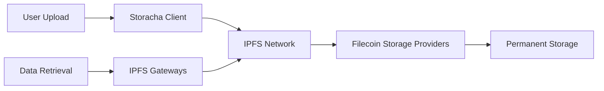

# Filecoin Integration Guide

## Overview

Dallnk leverages Filecoin's decentralized storage network to provide permanent, censorship-resistant data storage for bounty submissions. This guide details how our platform integrates with Filecoin infrastructure.

## Architecture



## Storage Flow

### 1. Data Upload Process

```typescript
// app/utils/web3storage.ts
export const uploadToFilecoin = async (file: File, email: string) => {
  try {
    // Initialize Storacha client
    const client = await createStorachaClient(email);

    // Upload to IPFS/Filecoin
    const cid = await client.uploadFile(file);

    return {
      success: true,
      cid: cid.toString(),
      size: file.size,
      type: file.type,
    };
  } catch (error) {
    // Fallback to mock CID for demo
    return generateMockCID(file);
  }
};
```

### 2. Content Addressing

Every file uploaded receives a unique **Content Identifier (CID)**:

```
bafybeigdyrzt5sfp7udm7hu76uh7y26nf3efuylqabf3oclgtqy55fbzdi
```

**CID Structure:**

- `bafy`: Base32 prefix
- `beig...`: Content hash using SHA-256
- Immutable: Same content = same CID
- Verifiable: Hash can be validated

### 3. Data Retrieval

```typescript
// Multiple gateway access
const gateways = [
  `https://w3s.link/ipfs/${cid}`,
  `https://ipfs.io/ipfs/${cid}`,
  `https://gateway.pinata.cloud/ipfs/${cid}`,
];

export const downloadFromIPFS = async (cid: string, filename: string) => {
  for (const gateway of gateways) {
    try {
      const response = await fetch(gateway);
      if (response.ok) {
        const blob = await response.blob();
        // Trigger download...
        return;
      }
    } catch (error) {
      // Try next gateway
    }
  }
  throw new Error("File not accessible from any gateway");
};
```

## Filecoin Benefits

### Decentralization

- **No Single Point of Failure**: Files distributed across multiple storage providers
- **Censorship Resistance**: Content cannot be arbitrarily removed
- **Global Accessibility**: Available from anywhere with internet

### Permanence

- **Long-term Storage**: Files stored for extended periods
- **Redundancy**: Multiple copies across the network
- **Verifiable Storage**: Cryptographic proofs of storage

### Cost Efficiency

- **Competitive Pricing**: Market-driven storage costs
- **Pay-per-Use**: Only pay for storage you need
- **No Vendor Lock-in**: Open protocol standards

## Storage Verification

### Content Integrity

```typescript
// Verify file hasn't been tampered with
const verifyContent = async (file: File, expectedCID: string) => {
  const actualCID = await generateCID(file);
  return actualCID === expectedCID;
};
```

### Storage Proofs

Filecoin provides cryptographic proofs that data is actually stored:

- **Proof of Replication**: Data is physically stored
- **Proof of Spacetime**: Data remains stored over time

## Migration from Web3.Storage

We've migrated from the deprecated Web3.Storage to Storacha:

```typescript
// Old Web3.Storage (deprecated)
// const client = new Web3Storage({ token });

// New Storacha implementation
const client = await createStorachaClient(email);
```

Benefits of migration:

- ✅ Continued development and support
- ✅ Enhanced performance
- ✅ Better reliability
- ✅ Future-proof technology stack

## Configuration

### Environment Variables

```bash
# .env.local
NEXT_PUBLIC_STORACHA_EMAIL=your-email@example.com
```

### Client Initialization

```typescript
import { create } from "@storacha/w3up-client";

const createStorachaClient = async (email: string) => {
  const client = await create();
  await client.login(email);
  return client;
};
```

## Error Handling

### Fallback Strategy

```typescript
export const uploadToFilecoin = async (file: File, email: string) => {
  try {
    // Attempt Storacha upload
    return await uploadViaStoracha(file, email);
  } catch (error) {
    console.warn("Storacha upload failed, using fallback");
    // Generate mock CID for development/demo
    return generateMockCID(file);
  }
};
```

### Mock CID Generation

```typescript
const generateMockCID = async (file: File): Promise<StorageResult> => {
  const fileContent = await file.arrayBuffer();
  const hash = await crypto.subtle.digest("SHA-256", fileContent);
  const hashArray = Array.from(new Uint8Array(hash));
  const hashHex = hashArray
    .map((b) => b.toString(16).padStart(2, "0"))
    .join("");

  return {
    success: true,
    cid: `bafybei${hashHex.substring(0, 52)}`,
    note: "Mock CID for development",
  };
};
```

## Best Practices

### File Optimization

```typescript
// Optimize files before upload
const optimizeForStorage = (file: File) => {
  // Compress if needed
  if (file.size > 10 * 1024 * 1024) {
    // 10MB
    return compressFile(file);
  }
  return file;
};
```

### Batch Uploads

```typescript
// Upload multiple files efficiently
const batchUpload = async (files: File[], email: string) => {
  const results = await Promise.allSettled(
    files.map((file) => uploadToFilecoin(file, email))
  );
  return results;
};
```

### Caching Strategy

```typescript
// Cache CIDs locally
const cidCache = new Map<string, string>();

const getCachedCID = (fileHash: string): string | null => {
  return cidCache.get(fileHash) || null;
};
```

## Monitoring & Analytics

### Storage Metrics

- **Upload Success Rate**: Track successful uploads
- **Gateway Performance**: Monitor retrieval speeds
- **Storage Costs**: Track Filecoin expenses

### Usage Tracking

```typescript
// Track storage usage
interface StorageMetrics {
  totalUploads: number;
  totalSize: number;
  averageFileSize: number;
  successRate: number;
}
```

## Troubleshooting

### Common Issues

1. **Upload Failures**

   ```typescript
   // Check network connectivity
   // Verify Storacha email configuration
   // Implement retry logic
   ```

2. **Retrieval Issues**

   ```typescript
   // Try multiple gateways
   // Check CID validity
   // Verify file exists on network
   ```

3. **Performance**
   ```typescript
   // Use appropriate file sizes
   // Implement progress indicators
   // Cache frequently accessed content
   ```

## Future Roadmap

- **Direct Filecoin Integration**: Skip IPFS layer for large files
- **Storage Deal Management**: Direct control over storage providers
- **Custom Gateway**: Dedicated retrieval infrastructure
- **Advanced Encryption**: Client-side encryption before upload

---

This integration ensures that all bounty data in Dallnk benefits from Filecoin's robust, decentralized storage infrastructure, providing users with permanent, verifiable, and globally accessible data storage.
